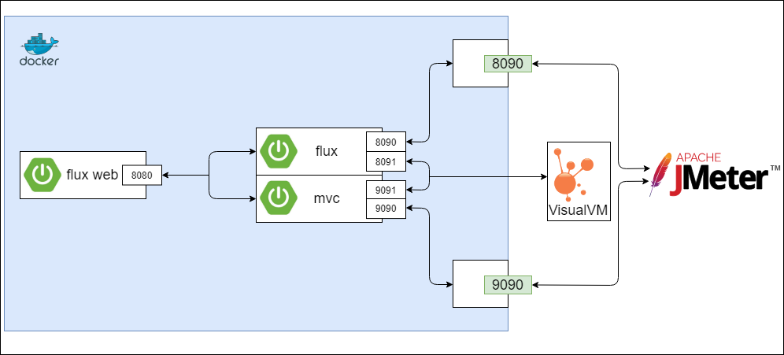

SPRING MVC VS. SPRING WEBFLUX

1. build service image
   - under folder flux: `docker build -t vioao/flux .`
   - under folder mvc: `docker build -t vioao/mvc .`
   - under folder web: `docker build -t vioao/web .`

2. run the service under this folder with limited cpu and memory
   > docker-compose --compatibility up

3. begin performance test with jmeter, just import the configuration file under folder jmeter and configure the thread group by yourself.

4. you can configure your jmx to monitor the resources usage

Under the static folder, there is a stress test result(with 1000 threads, 10 ramp-up period, 50 execute times) to test the issue that there is remote network call with 10ms delay.
